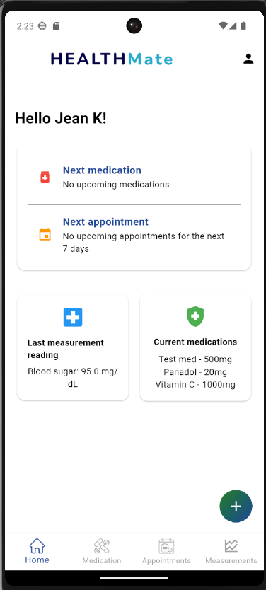

# 🌿 HealthMate MVP

**HealthMate** is an AI-powered mobile health assistant designed to help users — especially in rural areas — manage their medications, appointments, and health measurements such as blood pressure and blood sugar.  

---

## 🧩 Project Overview

The HealthMate MVP consists of two main components:

| Component | Description | Repository |
|------------|--------------|-------------|
| **Backend (FastAPI + Firebase)** | Handles authentication, database operations, and AI processing (OCR for measurements, reminders, etc.) | [HealthMate Backend](https://github.com/Jeanne21/healthmate-backend) |
| **Frontend (Flutter)** | Mobile interface where users can log in, manage medications and appointments, and view health insights | [HealthMate Flutter](https://github.com/Jeanne21/healthmate-flutter) |

---

## 🚀 Live Demo

- 🌐 **Web Version:** Not deployed 
- 🧠 **API Base URL:** [https://healthmate-api.onrender.com](https://healthmate-backend-kh0n.onrender.com)

---

## 📱 Features Implemented in the MVP

### 🩺 Core Functionalities
- User authentication (signup, login, and session check)
- Add and track medications with refill reminders
- Add and view upcoming health appointments
- Record health measurements manually or via image upload (OCR) *(planned feature)*
- View history of blood pressure and sugar readings
- Smart AI assistant for voice and text-based health guidance *(planned feature)*

### 👥 User Management
- Each user can manage their own profile   

---

## 🏗️ System Architecture

```text
Flutter App (Frontend)
       ⬇
FastAPI Backend
       ⬇
Firebase Firestore (Database)
       ⬇
AI Models (OCR / Image Recognition)
````

---

## ⚙️ Tech Stack

| Layer              | Technologies                                                |
| ------------------ | ----------------------------------------------------------- |
| **Frontend (MVP)** | Dart, Flutter, Flutter Web                                  |
| **Backend**        | Python, FastAPI, Firebase Firestore                         |
| **AI Processing**  | Tesseract OCR, OpenCV, PyTorch (planned for rash detection) |
| **Deployment**     | Firebase Hosting (web), Render (backend)            `       |

---

## 🧠 Future Improvements

* Integration of a conversational AI health assistant
* Machine learning model for skin condition image analysis
* Native Android app release on Google Play
* Offline data syncing for rural users
* Enhanced accessibility for elderly users

---

## 📸 Screenshots (To Add Later)

# Home Screen


---

## 💻 How to Run Locally

### Frontend (Flutter)

```bash
git clone https://github.com/Jeanne21/healthmate-flutter.git
cd healthmate-flutter
flutter pub get
flutter run
```

### Backend (FastAPI)

```bash
git clone https://github.com/Jeanne21/healthmate-backend.git
cd healthmate-backend
pip install -r requirements.txt
uvicorn app.main:app --reload
```

---

## 🧑‍💻 Developer

**Jeanne Wanjiru**
Software Engineer | AI & Mobile Development Enthusiast 

---

## 🏁 Acknowledgements

* **Power Learn Project (PLP)** — for mentorship and guidance
* **OpenAI, Firebase, and FastAPI** communities for their open-source resources
* Early testers and mentors who provided feedback during MVP development

---

> 💬 *“Empowering rural communities through smart, accessible healthcare technology.”*
